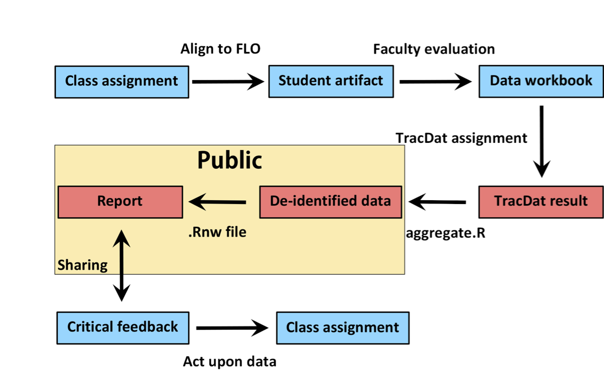

# Introduction {#intro -}

This report is an actual analysis of real course-level assessment data from a 200-level Biology course. However, its primary purpose is to serve as a proof-of-concept for the new General Education assessment process at Ferris State University. Assessment is perhaps best viewed as a scholarly activity that is focused upon programmatic improvement. Such scholarly work should be built upon, and contribute to, the relevant professional literature [@Weimer2015]. To emphasize that reality, this report is formatted in the form of a journal article. This report, and ones like it, will be authored, published, and cited in future work to support the development and improvement of the General Education program at Ferris.

Many different approaches can be used to assess a General Education program; direct and indirect assessment can take place at the course, program, or institutional levels. The structure, strengths and weaknesses of each of these are highlighted elsewhere [@Allen2006a]. Regardless of the approach used, a quality program evaluation must possess five key attributes: utility, feasibility, propriety, accuracy, and accountability [@Yarbrough2011]. Both this report, and the assessment processes underlying it, are designed to satisfy these requirements.

```{r process, echo=FALSE, out.width='90%', fig.cap='A diagram illustrating the flow of data from initial collection to storage, access, and use. This process constitutes "closing the loop" on assessing General Education competencies. The blue boxes highlight steps with direct faculty involvement; the red boxes indicate processes carried out by the General Education Coordinator. The golden region indicates the files that are publicly available on the Open Science Framework.'}

```

The _utility_ of the assessment process is a measure of how useful it is to the relevant stakeholders. A broad sampling of our faculty are engaged in the section of assessment outcomes, collection of data, and interpretation of assessment findings. This involvement ensures that any results are viewed within an appropriate context, and increases their value for program evaluation. The automated nature of the data collection, aggregation, and analysis increases the _feasibility_ of this approach. Much of the reports must still be authored by the General Education Coordinator. However, having the data manipulations and analysis done automatically greatly simplifies the task. _Propriety_ speaks to the ethical use of the data and results. Every effort has been made to ensure that the identities of all students and faculty involved in these studies is protected. No personally identifiable information will ever be included in these results. Furthermore, the General Education assessment results exist solely for the improvement of the General Education program -- the results will <u>never</u> be used for the evaluation of specific courses or instructional personnel. The _accuracy_ of these reports is improved by the very nature of the analysis and reporting used. Meta-analyses [@Borenstein2011] are used to compare groups of related assessment results. This approach can account for variation in scoring and student ability between courses and provide an a more realistic overview of student competencies. The range of meta-data collected in addition to student evaluations will permit the testing of a variety of research hypotheses. This report is also a form of reproducible research [@Stodden2014]. This report is computationally reproducible because the code needed to manipulate the de-identified data, perform the analyses, and create the figures are included within the Rmarkdown (.Rmd) files themselves. This approach was first described as "literate programming" in the 1980's [@Knuth1984]. The principle advantage to this approach is that anyone (at any time) can reproduce, critique, and extend these studies without needing to track down multiple documents, graphics files, and data sets. Finally, the _accountability_ of reports such as this one is safeguarded by the involvement of faculty in contextualizing the results. All reports will be shared with appropriate focus groups for their input. Their comments and recommendations for future actions will be summarized and included within the discussion section of each document.

The overall process employed in this assessment strategy is illustrated in Figure \@ref(fig:process) and described in the Methods. As a proof-of-concept, 13 semesters of student results from a 200-level Biology course are analyzed. A more typical analysis would be from a variety of courses (say from Biology, Chemistry, Physics, Geology, and Geography) to evaluate a specific FLO over a specific period of time.

